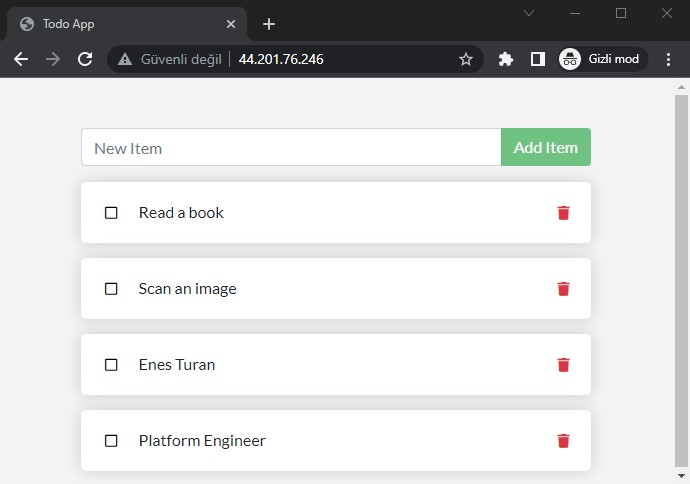

<div align="center" id="top"> 
  <!--  -->

  <!-- &#xa0; -->

  <!-- <a href="https://todowebapp.netlify.app">Demo</a> -->
</div>

<h1 align="center">Todo Web Application</h1>

<p align="center">
  <a href="https://github.com/devenes/todo-web-app/actions/workflows/node.js.yml"> </a>
  
  
  
  
  
  
  
  
    
  <!-- 
  
   -->
</p>

<!-- Status -->

<!-- <h4 align="center"> 
	🚧  Todo Web App 🚀 Under construction...  🚧
</h4> 

<hr> -->

<p align="center">
  <a href="#dart-about">About</a> &#xa0; | &#xa0; 
  <a href="#rocket-technologies">Technologies</a> &#xa0; | &#xa0;
  <a href="#white_check_mark-requirements">Requirements</a> &#xa0; | &#xa0;
  <a href="#checkered_flag-starting">Starting</a> &#xa0; | &#xa0;
  <a href="#-Expected-Output">Output</a> &#xa0; | &#xa0;
  <a href="#memo-license">License</a> &#xa0; | &#xa0;
  <a href="https://github.com/devenes" target="_blank">Author</a>
</p>

## :dart: About ##

Javascript web application to manage your todo list in a simple and easy way 🚀 

## :rocket: Technologies ##

The following tools were used in this project:

- [Node.js](https://nodejs.org/en/)
- [JavaScript](https://developer.mozilla.org/en-US/docs/Web/JavaScript)
- [CSS](https://developer.mozilla.org/en-US/docs/Web/CSS)
- [HTML](https://developer.mozilla.org/en-US/docs/Web/HTML)
- [Docker](https://www.docker.com/)
- [Git](https://git-scm.com/)
- [GitHub](https://github.com/)
- [Yarn](https://yarnpkg.com/)
- [React](https://reactjs.org/)
- [Express](https://expressjs.com/)
- [SQLite](https://www.sqlite.org/)

## :white_check_mark: Requirements ##

Before starting :checkered_flag: you need to have [Git](https://git-scm.com), [Docker](https://www.docker.com/), [Yarn](https://yarnpkg.com/) and [Node](https://nodejs.org/en/) installed.

## :checkered_flag: Starting ##

### If you want to start the project locally, you can use the following commands:

```bash
# Clone this project
git clone https://github.com/devenes/todo-web-app
```

```bash
# Access
cd todo-web-app
```

```bash
# Install dependencies
yarn install --production
```

```bash
# Run the project
# The server will initialize in the <http://localhost:3000>
node /src/index.js
```

### If you want to run the project in a Docker container, you can use the following command:

- Build the Docker container image using the `docker build` command.

```bash
docker build -t todo-app:v1.0 .
```

- Show the Docker image is created successfully.

```bash
docker image ls
```

- Run `todo app` from the local Docker image.

```bash
docker run --name todo -d -p 80:3000 todo-app:v1.0
# The server will initialize in the <http://localhost:80>
```

- List running container.

```bash
docker ps
# or
docker container ls
```

## 📷 Expected Output ##



## 📚 Resources

- [Node.js Documentation](https://nodejs.org/en/docs/)

- [GitHub Documentation](https://docs.github.com/en/get-started/)

- [Docker Documentation](https://docs.docker.com/get-started/overview/)

## :memo: License ##

This project is under license from Apache. For more details, see the [LICENSE](LICENSE) file.


Made with :heart: by <a href="https://github.com/devenes" target="_blank">devenes</a>

&#xa0;

<a href="#top">⬆️ Back to top</a>
